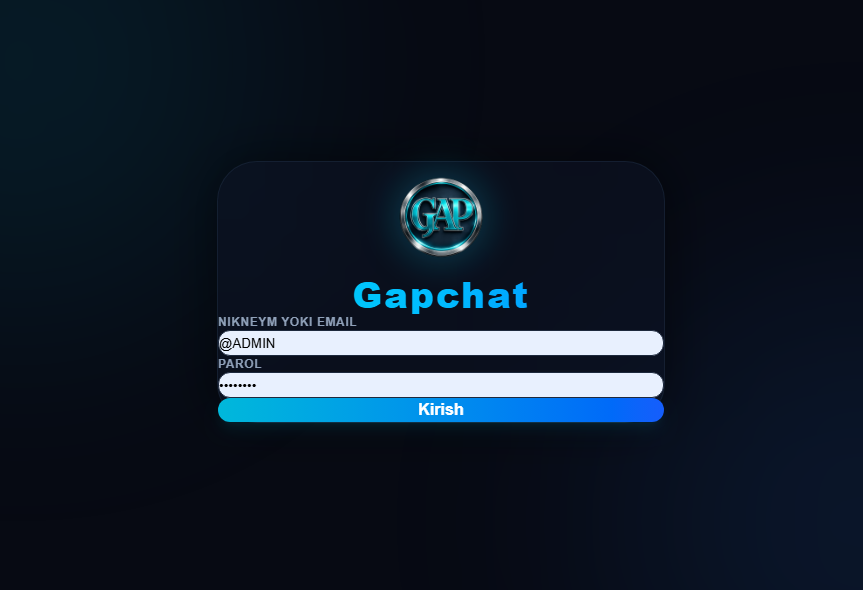

# 💬 GapChat

**GapChat** is a modern real-time messaging application built with the MERN Stack. Designed with a clean, responsive interface and powered by WebSockets, it enables users to communicate instantly through private messaging with a fast and seamless chat experience.

Whether you're chatting with friends, testing real-time communication, or exploring full-stack web development, **GapChat** provides a secure, modern, and user-friendly messaging platform.

---

# ✨ Features

## 💬 Real-Time Messaging

Send and receive messages instantly using real-time communication powered by WebSockets.

## 👤 User Authentication

Secure login system allowing users to access their personal chat environment safely.

## 🟢 Online Status

See which users are currently online with real-time presence updates.

## 🔍 User Search

Quickly search for other users by username to start a conversation.

## 📷 Image Sharing

Share images directly inside conversations for a richer messaging experience.

## 🔔 Instant Notifications

Receive real-time notifications whenever a new message arrives.

## 🎨 Modern UI/UX

Enjoy a clean messaging interface featuring:

- Responsive layout
- Modern dark theme
- Smooth animations
- Clean conversation design
- User-friendly navigation
- Mobile-friendly interface

## ⚡ Fast Performance

Optimized React components and backend services provide smooth real-time communication across desktop and mobile devices.

---

# 📸 Preview

<div align="center">
  <a href="https://mfs-portfoliouz.netlify.app/portfolio1/projects">
    
  </a>
  <p><i>Click to watch the demo on my portfolio</i></p>
</div>

*Click to explore the live application.*

---

# 🛠️ Built With

| Technology | Purpose |
|------------|----------|
| React.js | Frontend User Interface |
| Node.js | Backend Runtime |
| Express.js | REST API & Server |
| MongoDB | Database |
| Socket.IO | Real-Time Messaging |
| HTML5 | Structure |
| CSS3 | Styling & Responsive Design |
| JavaScript (ES6+) | Application Logic |

---

# 🚀 Getting Started

## Clone the Repository

```bash
git clone https://github.com/muxriddin-web/gapchat.git
```

---

## Navigate into the Project

```bash
cd gapchat
```

---

## Install Dependencies

Frontend

```bash
cd client
npm install
```

Backend

```bash
cd server
npm install
```

---

## Start the Application

Frontend

```bash
npm run dev
```

Backend

```bash
npm run dev
```

---

# 💬 Application Features

| Feature | Description |
|----------|-------------|
| 🔐 Login Authentication | Secure user login |
| 💬 Real-Time Chat | Instant messaging |
| 🟢 Online Users | Live online status |
| 🔍 User Search | Find users quickly |
| 📷 Image Messages | Send photos |
| 🔔 Notifications | Real-time alerts |
| 📱 Responsive UI | Mobile & Desktop support |

---

# 🔒 Authentication System

The application includes:

- Secure login
- JWT Authentication
- Protected routes
- User sessions
- Authentication middleware

Future versions will include user registration, password recovery, and email verification.

---

# 📊 Chat Features

GapChat currently supports:

- ✅ Private messaging
- ✅ Real-time communication
- ✅ Online status
- ✅ Image sharing
- ✅ User search
- ✅ Message notifications

---

# 📱 Responsive Design

Fully optimized for:

- 💻 Desktop
- 💼 Laptop
- 📱 Mobile
- 📟 Tablet

---

# 🌟 Future Roadmap

- [ ] 👥 Group Chats
- [ ] 📞 Voice Calls
- [ ] 🎥 Video Calls
- [ ] 😊 Emoji Picker
- [ ] 📝 Message Editing
- [ ] ❌ Message Deletion
- [ ] 📂 File Sharing
- [ ] 🌙 Dark / Light Mode
- [ ] 🔐 End-to-End Encryption
- [ ] 🌍 Multi-language Support
- [ ] ☁️ Cloud Media Storage

---

# 📂 Project Structure

```text
gapchat/
│
├── client/
│   ├── src/
│   ├── public/
│   └── package.json
│
├── server/
│   ├── src/
│   ├── controllers/
│   ├── routes/
│   ├── models/
│   ├── middleware/
│   └── package.json
│
├── README.md
└── LICENSE
```

---

# 🤝 Contributing

Contributions are always welcome!

Fork the repository.

Create your feature branch.

```bash
git checkout -b feature/AmazingFeature
```

Commit your changes.

```bash
git commit -m "Add AmazingFeature"
```

Push to GitHub.

```bash
git push origin feature/AmazingFeature
```

Open a Pull Request.

---

# 📝 License

This project is distributed under the **MIT License**.

See the **LICENSE** file for more information.

---

# 📬 Contact

If you have questions, suggestions, or feedback, feel free to reach out.

### Project Repository

```text
https://github.com/muxriddin-web/gapchat
```

### Author

**Muxriddin O'tkirov**

### GitHub

```text
https://github.com/muxriddin-web
```

---

# ⭐ Support

If you like this project, don't forget to give it a ⭐ on GitHub!

It helps the project grow and motivates future development.

---

# 💡 Quote

> **"Connecting people, one message at a time."**

---

## ❤️ Made with React, Node.js, Express.js, MongoDB & Socket.IO
